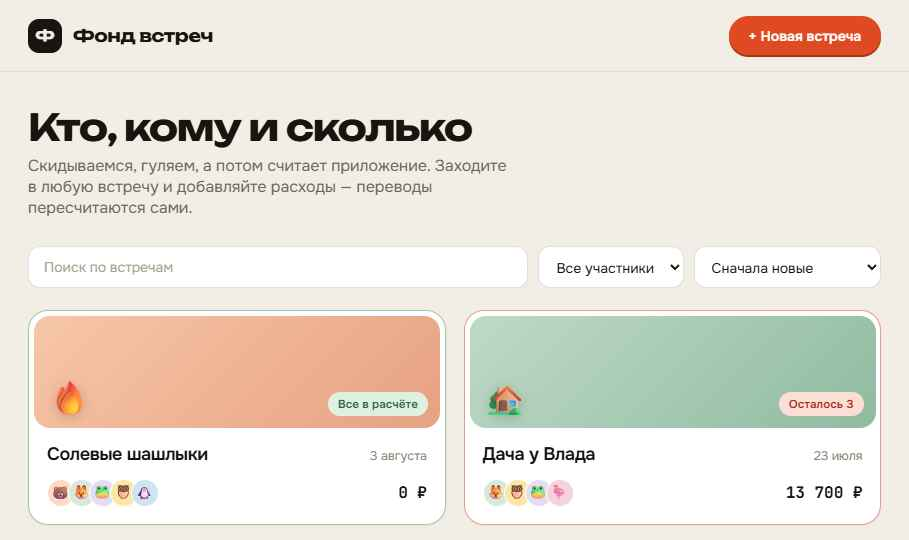

# Reckoner

Who owes whom, and how much. A shared-expense tracker for get-togethers with friends: you add
what everyone paid, and the app works out the smallest set of transfers that settles everyone up.

A React + TypeScript PWA (installable on Android, iOS and desktop, no native wrappers) with a
Rust/Axum backend and Postgres.



> The image above is the **design reference**, not a screenshot of a running app — see Status
> below. The interface language is Russian; this README is in English.

## Status

Early. The design is finalised and the scaffold is in place; the application itself is not built
yet.

- **Done** — product and technical design, written up in
  [`docs/superpowers/specs/2026-08-04-reckoner-design.md`](docs/superpowers/specs/2026-08-04-reckoner-design.md):
  data model, REST API, settlement algorithm, frontend structure, deployment and test strategy.
- **Not done** — everything else. The backend currently answers `GET /api/health` and nothing
  more; the frontend is a one-page smoke test that calls it and prints the result. There is no
  database wired up yet.

## What it does

Each participant can spend money on the meetup, once or several times. That raises the total and
is split across everyone present. From the totals the app derives, for every participant who has
underpaid, the list of transfers they need to make to come out even — recomputed on every change.

- No sign-in. Anyone who opens the site sees every meetup, and can search, filter by participant
  and sort the list. A colour tells you at a glance whether a meetup is settled: green for
  nothing outstanding, yellow for one or two transfers left, red for three or more.
- Inside a meetup: cover image, title, description, participants, and the history of operations
  sorted by time. Each entry records who paid, how much, what for, and — for a transfer — who
  received it.
- Expenses can be split unevenly: a participant's share can be set to 1, ¾, ½, ¼ or 0.
- Below the history, the outstanding transfers needed to close the meetup at par, in three
  views: a per-debtor list, a debtor/creditor matrix, and a balance bar chart.
- All amounts are whole roubles. Splitting is integer arithmetic with the remainder handed out by
  largest fractional part, so the shares of an expense always add up to it exactly, balances
  always sum to zero, and the transfer plan always closes a meetup at par.

## Stack

- **`frontend/`** — Vite, React, TypeScript. PWA via `vite-plugin-pwa` (manifest, service worker,
  install to device). Deployed to GitHub Pages.
- **`backend/`** — Rust, Axum, Postgres via `sqlx`. Deployed to Render, database on Neon.

The backend keeps only facts in the database. Balances, the transfer plan and meetup status are
never stored: they are computed on read by a pure `domain` module that knows nothing about SQL or
HTTP, which keeps the money logic in one place and testable without any infrastructure.

## Repository layout

```
backend/                  Rust + Axum API
frontend/                 React + TypeScript PWA
docs/design/              design handoff: tokens, screens, prototype
docs/superpowers/specs/   implementation spec
```

## Getting started

Prerequisites: [Rust](https://rustup.rs) 1.85 or newer (the crate uses edition 2024) and
[Node.js](https://nodejs.org) LTS.

Two terminals:

```bash
cd backend && cargo run
```

```bash
cd frontend && npm install && npm run dev
```

Vite prints the dev URL it picked, usually `http://localhost:5173`. It proxies `/api/*` to
`http://localhost:3000`, where the backend listens, so there are no CORS problems in development.
Open the page: it should show `ok` and the response from `GET /api/health`.

### Checking the PWA locally

```bash
cd frontend && npm run build && npm run preview
```

Open the URL `npm run preview` prints (usually `http://localhost:4173`). In Chrome or Edge an
install button should appear in the address bar, which means the manifest and service worker are
wired up correctly.

## Documentation

- [`docs/superpowers/specs/2026-08-04-reckoner-design.md`](docs/superpowers/specs/2026-08-04-reckoner-design.md)
  — the implementation spec. Start here.
- [`docs/design/handoff.md`](docs/design/handoff.md) — design handoff: colours, typography,
  spacing, per-screen behaviour and exact copy. The source of truth for how the app should look.
- [`docs/design/meetup-splitter.dc.html`](docs/design/meetup-splitter.dc.html) — HTML prototype
  with the calculations actually working. A behavioural reference; open it in a browser, do not
  port it into the codebase.
- [`docs/design/screens/`](docs/design/screens/) — five screenshots of the finished design.

## Known rough edges in the scaffold

These are recorded in the spec and will be dealt with as implementation proceeds:

- CORS is wide open (`CorsLayer::new().allow_origin(Any)`), which is fine for local development
  and must be narrowed to the deployed frontend's origin before going live.
- `GET /api/ws` is a WebSocket echo left over from the scaffold. The spec drops realtime updates
  in favour of refetching, so this endpoint is going away.
- The PWA manifest still carries template values (`start_url: '/'`, a blue `theme_color`, the name
  "Reckoner") and the icons are flat-colour placeholders.
- `axum` and `tower-http` are pinned to 0.7 and 0.5 from scaffold time. Bumping them is optional
  and not urgent.
